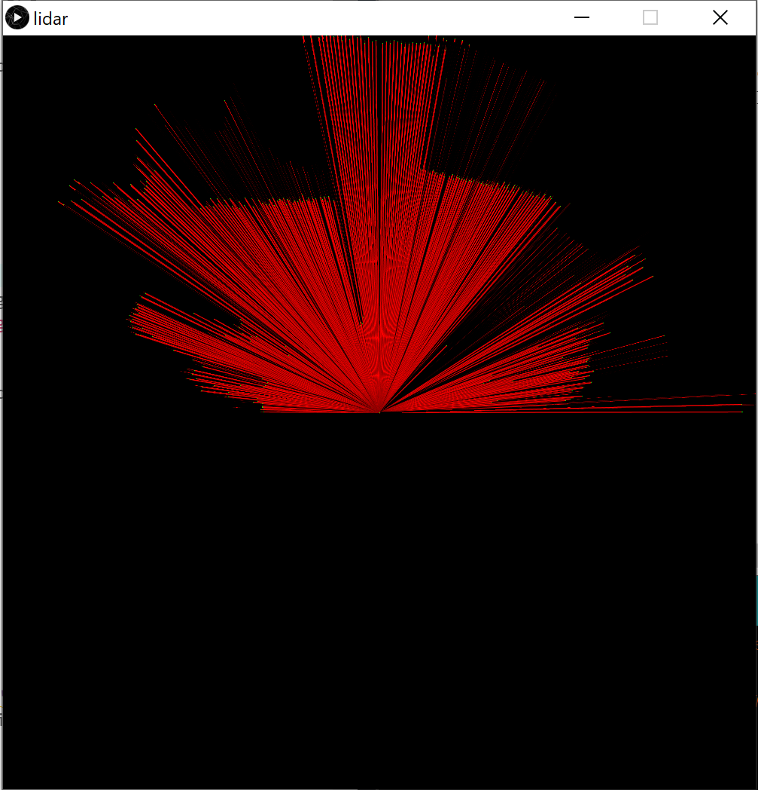
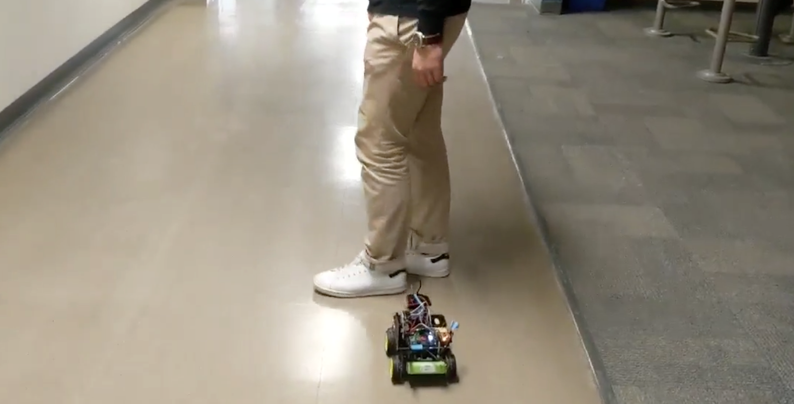

# Lidar Navigated Robot Car

## Participating Students
* Kevin Lin
* Tianhao William Jiang
* Ryan Yuen
* Sharfaraz Ahmed

### Ryerson University
Faculty of Engineering and Applied Science

Department of Mechanical and Industrial Engineering

Faculty Advisor: Dr. Siyuan He
___
# Abstract

This project presents the design and construction of a LIDAR navigated robot car based on the Mechbot used in the MEC733 course. By implementing LIDAR, this project will aim to improve the navigation capabilities of the Mechbot, which currently uses IR for sensing and navigation.
___
# Pictures

Final prototype: 

LiDAR scan output:

Demo: 

## Full details in Report.pdf
